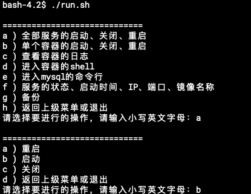
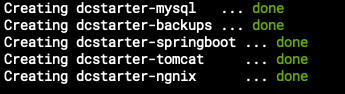
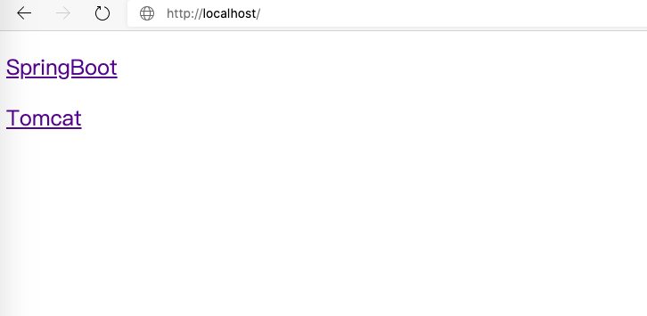
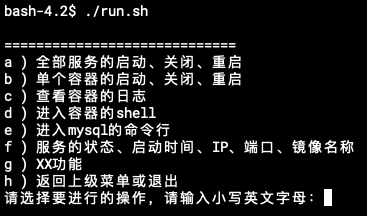

# Docker-Compose Starter
## 前言

做开发的同学经常要搭建一个测试环境，虽然Docker可以简化维护的工作，但也带来了一堆要记忆的命令和参数。

DC-Starter的目标是要降低部署和维护后台应用的总拥有成本：
1. 开箱即用：帮助你快速把后台应用跑起来，可以搭建开发环境、测试环境、或者现网环境；
2. 低成本：以命令行交互菜单的方式进行管理，降低记忆和敲打Docker-Compose命令的负担。

## 快速开始

三步把本项目跑起来：

### 前置条件
1. 假设已经安装好Docker、Docker-Compose和git；
2. 80端未被占用

### 步骤
1. 拉取项目代码：

    ```
    git clone https://github.com/philiphuang/docker-compose-starter.git
    ```

2. 运行run.sh

    ```
    cd docker-compose-starter
    ./run.sh
    ```
    可以进入交互菜单，然后选择 ```a``` -> ```b``` ，启动所有服务。（第一次运行会经历漫长的拉取镜像过程，请耐心等候。）

    

    当你看到下面的文字，你已经喜提一个三层结构的应用，nginx + (tomcat，srpingboot) + mysql

    

3. 打开浏览器访问宿主机，例如：[http://localhost/](http://localhost/)

    

## 怎么用

DC-Starter对Docker-Compose的命令进行封装，提供了启动，停止容器，备份、还原数据，查看服务器IP，进入mysql命令行等。

    

    a) 对本项目所有容器进行管理，包括启动，关闭，重启

    b) 对单个容器进行管理，包括启动，关闭，重启

    c) 查看单个容器日志，适用于检查服务运行状况，查看调试日志

    d) 进入单个容器的shell

    e) 进入mysql容器的mysql命令行

    f) 查看个容器的运行状态，包括启动时间，端口和IP等信息

    g) 自定义脚本，可添加多个，例如备份，还原。

    h) 退出，如果进入了子菜单，则返回上一级菜单

## 部署流程

无论简单还是复杂的应用，都可以按照核心流程部署起来：
1. 修改.env
2. 修改docker-compose.yml，把各个网元架构搭起来
3. 把网元信息配置文件，
4. 修改run.sh

### 注意事项
1. DC-Starter的基础配置文件都放在.env里面
1. 宿主机上如果运行了多套应用，每套应用的PROJECT_NAME和IP_RANGE不能重复

### Nginx

### 备份

### 还原
